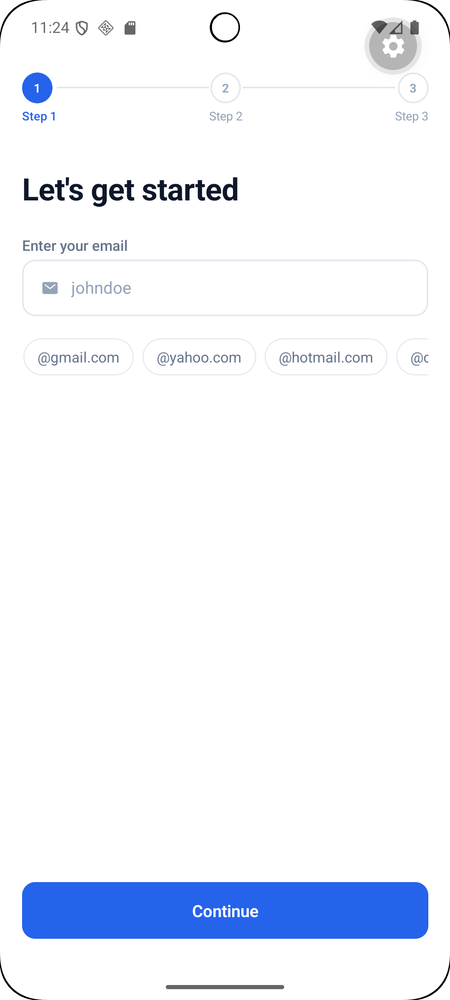

# OnboardingFlow

A professional React Native onboarding flow built with Expo SDK 55,
featuring LinkedIn integration, form validation, and smooth animations.

---

## 📱 Screens

| Screen | Description |
|--------|-------------|
| Splash | Animated intro screen with app branding |
| Step 1 | Email input with domain shortcuts and validation |
| Step 2 | LinkedIn OAuth connect or manual URL entry |
| Progress | Animated loader while profile is set up |
| Success | Congratulations screen with spring animations |

---

## 🛠 Tech Stack

| Tool | Purpose |
|------|---------|
| Expo SDK 55 | React Native framework |
| TypeScript | Type safety |
| React Navigation | Screen navigation |
| Zustand | Global state management |
| React Hook Form | Form handling |
| Zod | Schema validation |
| React Native Reanimated | Animations |
| expo-image | GIF rendering (Progress & Success screens) |

---

## 🚀 Getting Started

### Prerequisites
- Node.js v18+
- Expo Go app on your device or emulator

### Installation
```bash
# Clone the repo
git clone https://github.com/livinusonyenso/OnboardingFlow.git

# Navigate into the project
cd OnboardingFlow

# Install dependencies
npm install

# Start the development server
npx expo start --clear
```

### Running on device
- Scan the QR code with **Expo Go** (Android)
- Scan the QR code with **Camera app** (iOS)

---

## 📁 Project Structure
```
src/
├── screens/
│   └── onboarding/
│       ├── SplashScreen.tsx
│       ├── StepOneScreen.tsx
│       ├── StepTwoScreen.tsx
│       ├── ProgressScreen.tsx
│       └── SuccessScreen.tsx
├── components/
│   └── ui/
│       ├── Button.tsx
│       ├── Input.tsx
│       └── StepIndicator.tsx
├── theme/
│   ├── colors.ts
│   ├── typography.ts
│   └── spacing.ts
├── store/
│   └── onboardingStore.ts
├── hooks/
│   └── useOnboarding.ts
├── navigation/
│   └── OnboardingNavigator.tsx
└── types/
    └── navigation.ts
```

---

## ✨ Features

- ✅ Multi-step onboarding flow
- ✅ Email validation with domain shortcuts
- ✅ LinkedIn connect simulation
- ✅ Animated progress screen
- ✅ Spring animations on success
- ✅ Global state with Zustand
- ✅ Form validation with Zod
- ✅ Error boundary
- ✅ Smooth screen transitions
- ✅ TypeScript throughout

---

## 📸 Screenshots




---
## Video Walkthrough
<video controls src="assets/OnboardingFlow.mp4" title="Title"></video>

## 📲 Test the App

> Android only — APK build

### Option 1 · Direct Download (Expo)
1. Open the link below on your Android phone
2. Log in or create a free Expo account
3. Tap **Download** and install the APK

🔗 [Download APK](https://expo.dev/accounts/livinusonyenso/projects/onboarding-flow/builds/15c703a7-941a-4ed6-b672-db1e159ead12)

### Option 2 · Install from Unknown Sources
If prompted during installation:
```
Settings → Security → Install unknown apps → Allow
```

> ⚠️ iOS is not supported in this preview build


## 👤 Author
Ugwuja Livinus Ekene - Frontend Developer

**My Info**
- GitHub: https://github.com/livinusonyenso
- LinkedIn: https://www.linkedin.com/in/ugwuja-livinus-ekene-frontenddeveloper/


## 📄 License

MIT